# What is WhereWild?

You can view a high-level overview of what WhereWild is on the [About Page](https://wherewild.net/about).

# How to learn how to use WhereWild?

You can either watch the video tutorial above, or follow along this guide (or both!). This guide will try and provide plenty of screenshots to help you along.

# Species Page Basics

You can get to a species page by simply searching for any species in the search bar at the top. Right now, we only have plants and fungi in our database. You can search by scientific or vernacular name.

The species this guide will be using will be *Opuntia fragils*.

## Overview

The first thing you'll see on a species page is a high level overview with an image and description that attempts to briefly summarize the environments the species prefers.

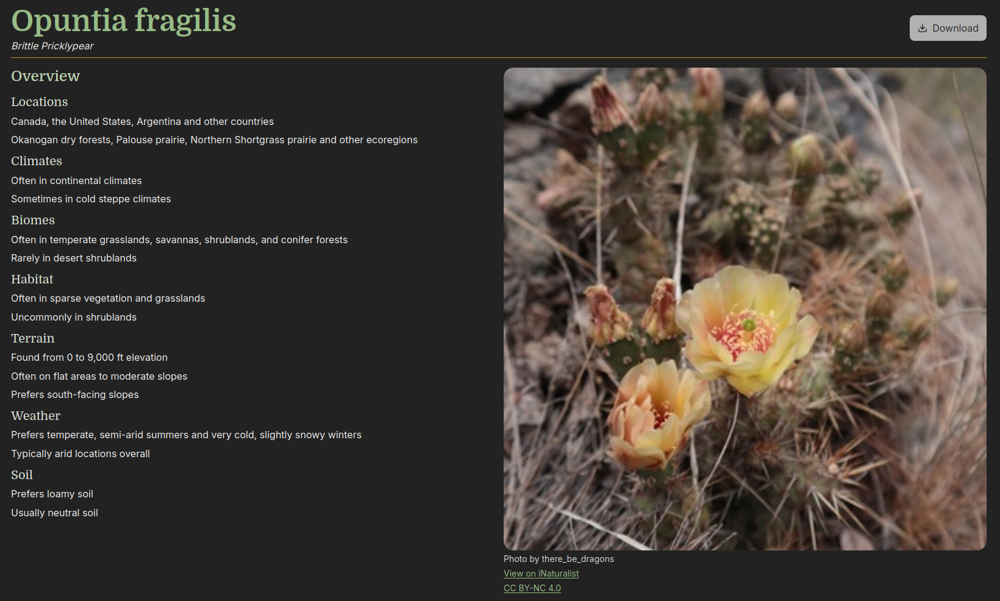

One important thing to note is that this description is **not** generated by Generative AI but rather an algorithm using data WhereWild has processed. Therefore, there are occasional quirks in these descriptions where they can be overly verbose or not quite right at times. This is a byproduct of trying to distill a lot of information into a few lines of text. The in-depth data is further down the page.

## Species Environment Section

Scroll down to the part of the page that says "Species Environment".

### Density Graph

You'll see the following density graph:

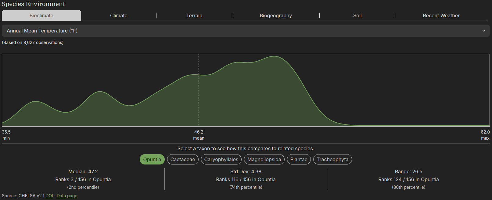

Note the selected variable; the default should be "Annual Mean Temperature". The density graph represents the *density* of observations at around a given value for the variable. You can think of it as a histogram that has been "smoothed" out. In this example, we can see a thin tail on the right of the distribution; meaning there seems to be a very sparse amount of observations of this plant near the upper range of its temperature tolerance. On the left we see some smaller "humps", which may represent clusters of subpopulations closer to the lower end of its temperature tolerance.

### Changing Variables

You can change the selected variable by clicking the box that says "Annual Mean Temperature". The tabs right above this box that say "Bioclimate", "Climate", etc denote the different groups of variables. By clicking them you can view even more options. Try choosing a different section, such as "Soil".

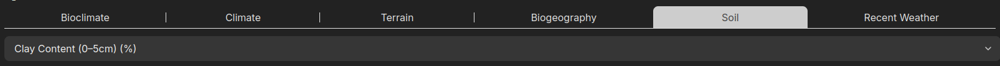

### Relative Rankings

If you selected soil, you should see a density graph for clay percentage in soil right now:

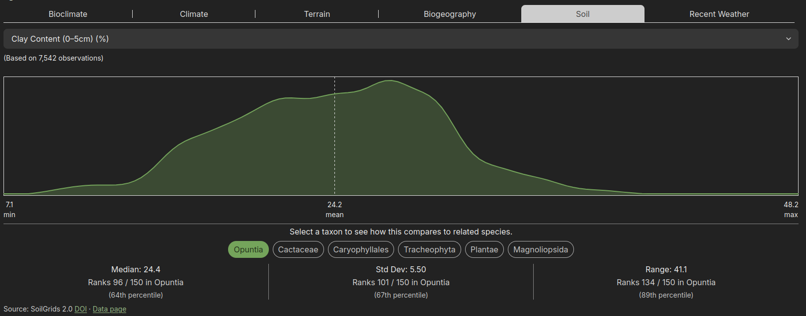

For this example, it seems the average clay content in the soil it grows in is around 24%. However, it may be difficult to interpret this value. Is that high, or low? What about compared to other closely related species?

The section right below the density graph can help with this. Denote how it displays various summary statistics, along with how the value compares to other related species, in this example, other species within *Opuntia*:

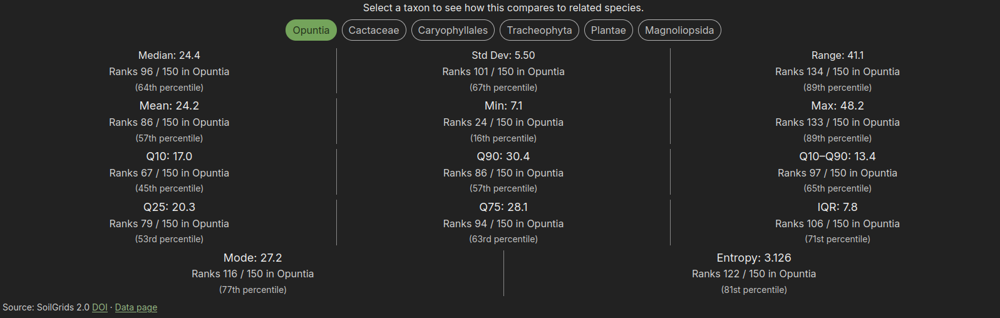

On many variables, you can click this section to display even more summary stats and rankings, as pictured above. You can change the comparison context by clicking one of the pills above the rankings, and can compare at every level of the taxonomic tree. For this example, we can see that this species is in the 64th percentile in *Opuntia* for clay percentage in soil, so it seems to be slightly above average in terms of clay content in soils compared to others in its genus. Its range is in the 90th percentile, so perhaps it has a relatively wide range of soil conditions it can tolerate.

### Other Types of Variables

Try clicking on the "Biogeography" section, and it should pull up "Land Cover" as a variable. Landcover is a nominal (add internal link to this guide) variable, and so it won't have a density graph. Rather there will be a colored bar and pills showing the different classes of landcover the species inhabits, along with how common they are in those classes.

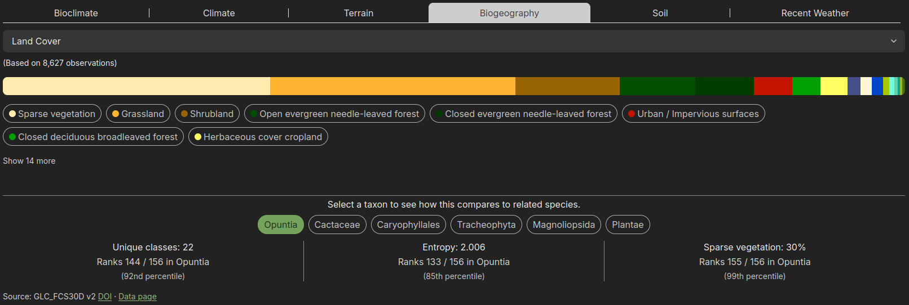

The summary stats computed here are different, so the relative ranks displayed here are different!

Another interesting case here are circular variables. You can go to the "Terrain" section and change the selection from "Elevation" to "Aspect". You should see a polar density chart reflecting the direction of slopes the plant prefers to grow on; in this case, we can observe a preference for south-facing slopes.

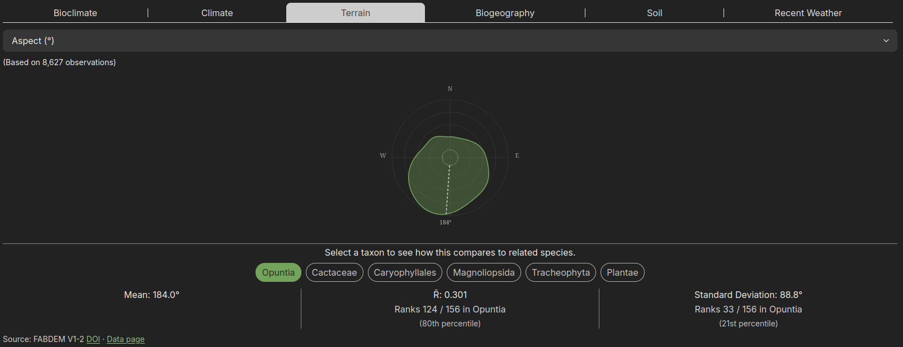

You can take a bit to explore some other variables.

## Species Occurrence Map

The next thing to look at is just a bit down the page. There will be a map showing all occurrences of the species as dots, colored to match the selected variable above. In the case of elevation, the map will look something like this:

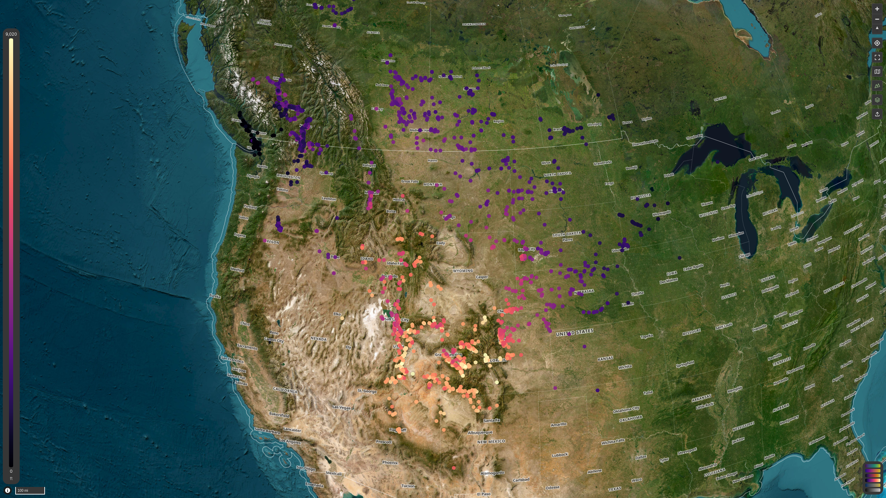

Note there is a legend on the left side showing the color gradient used along with the range. We can see this species spans around 0 to 9,000 ft elevation. In the case of a nominal variable like Landcover, the legend will display classes along with their colors, and update based on the dots within view.

### Interacting with the map

You can click on any dot on the map, and a popup with some information about the observation will show:

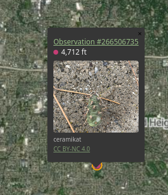

The link allows you to get to the corresponding observation on iNat.

You can even click any arbitrary point on the map for a popup showing you the value of the selected variable:

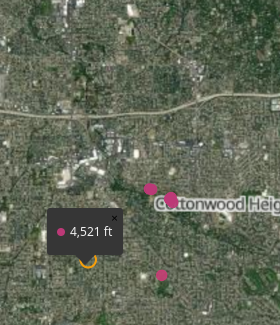

When doing this, it will also highlight where this specific location occurs on the density chart in the environment section above:

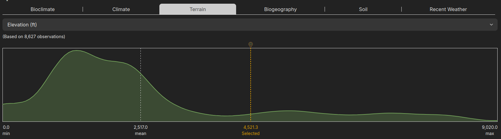

This is a good way to see if a specific location is a suitable habitat for a species or way out of line. For example, trying this with variables such as temperature or precipitation can let you know if a location is much too hot/cold or wet/dry for a species, as it will warn you if it's off the density graph entirely:

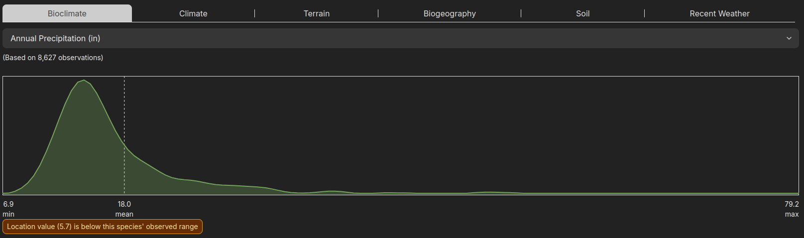

Where the above example is a place in Vegas, being drier than anywhere this plant has ever been observed.

## Species Observation Gallery

Right below the map, there is a place where you can view a gallery of observations and their corresponding images, along with their values in regards to the selected variable. This gallery only shows points within view of the map (and selected filters as we will go over shortly). You can click on the image of an observation in this gallery to bring up its pin on the map and density chart.

## Filters and Temporal Variables

Finally, you can scroll back up to right above the environment section where there are a few filters we skipped over:

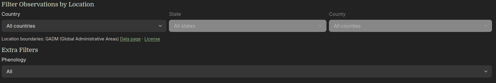

### Location Filter

The location filter should be mostly self-explanatory. You can select up to level-3 regions in GADM to filter observations on the map to only those within the location. This even updates the density graphs in question:

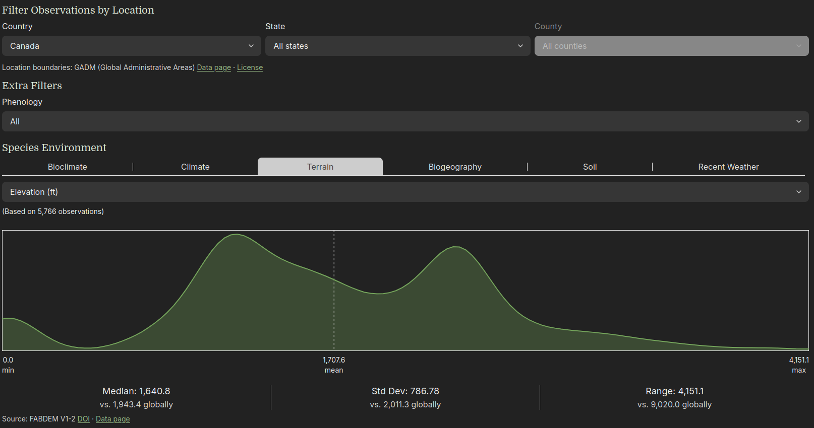

In this example we filtered to only observations within Canada. Note this also recomputes the summary statistics below the density graph, and instead of relative ranks, displays the new values relative to the global values. We can see here the average elevation in Canada is a bit lower than the global average elevation.

### Phenology Filter

The pheonology filter filters observations relative to their annotated phenology values on iNaturalist. This means things like whether the plant is budding, flowering, fruiting or seeding (or none of the above).

You may ask, why is this useful? Do plants that are flowering prefer things like higher elevations - they don't really move, do they? The answer is that this filter can be very useful when applied in combination with our temporal variables. Select a filter such as "Flowering" for the next part.

### Temporal Variables

Go to the final tab in the environmental section labeled "Recent Weather". The default will pull up the variable "Air Temperature (2m)" with the aggregation window of 1 hour:

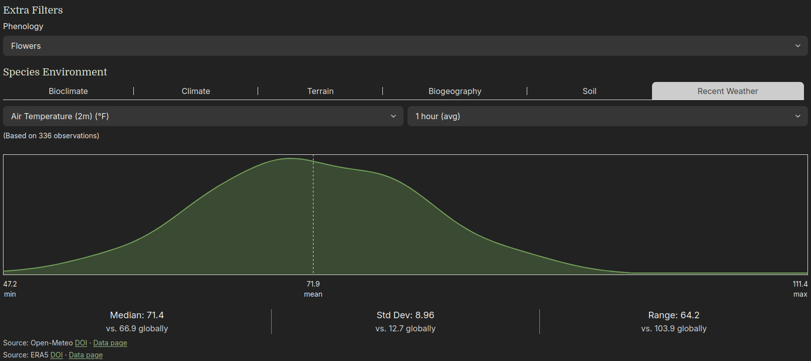

This entire section contains *temporal* variables, which add another dimension of time. Remember iNaturalist observations also contain a timestamp. This data then not only contains information about what the environment at a specific *place* is at, but also what it was at a specific *time*. In this case, it's simply the average temperature over the last hour at the time of observation.

If you want to confirm this, you could try removing the "Flowering" phenology filter and looking for darker dots on the map, representing times the species was observed when it's colder. Unless the species is more tropical, you should be able to see such dots correspond to observations clearly during the winter months when it would be quite cold, as seen below:

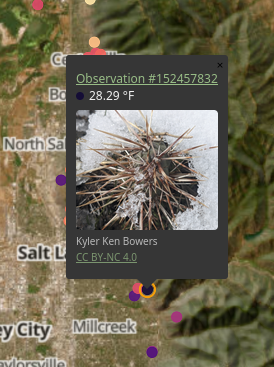

Re-apply the flowering phenology filter.

### Okay, But What is This Useful For?

To see how this might be helpful, we can select a different aggregation window. Where it says 1 hour in the selector, change it to 3 months.

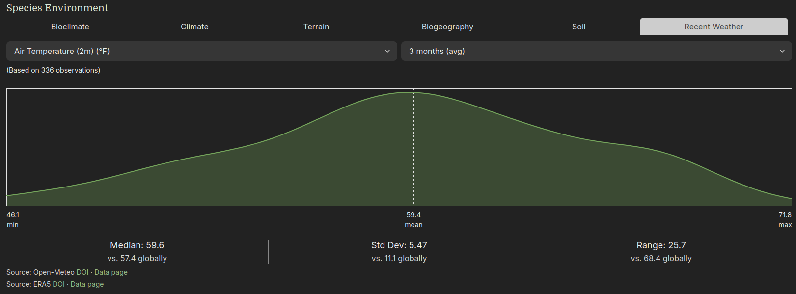

What this is now showing is, for all observations of this plant where it was flowering, how hot on average the past 3 months were. These values may seem uninterpretable to you, but try clicking anywhere on the map now where there is *not* an observation dot:

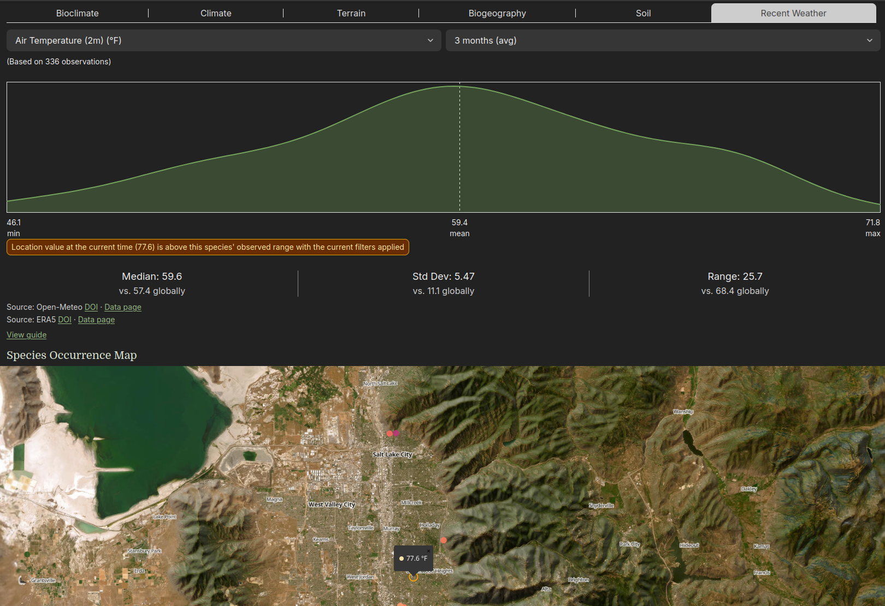

What this is saying is that in the Salt Lake Valley, an area where this species is very common, the average temperature over the past 3 months has been around 77 degrees Fahrenheit. Crucially however, that is a *hotter past 3 months* than *any* flowering observations of this species have experienced. What this means it that it's likely too late in the season, or has been too hot, for this species to be able to flower right now. Indeed, it is must past the flowering season for this species.

This has some marginal utility compared to the monthly observations-by-phenology graph iNaturalist has. While iNat's phenology graph is very useful, some seasons are different. Sometimes winter is warm and short and things start blooming a few weeks ahead of schedule. Sometimes the winter is very long and things start growing late. This may help you figure out how in-line the past few weeks or months of weather have been in regards to traditional phenology patterns for any given species, without having to drive out to any location and check yourself.

There are many other weather variables this section contains. It likely has utility as an additional source to check along with iNat's phenology graphs, as well as it being a kind of cool way to find observations at really hot or cold times, or during times of rain or snow.

# Advanced Species Page and Map Controls

Reset the phenology filter again. There are a few more advanced filters and things we can do on the species page, and in regards to map controls.

## Slicing and Slice Chaining

If you're looking at a density chart such as elevation, and want to isolate observations to ONLY those within the upper range of its elevation, you can click and drag on the map to isolate only those observations. The number of observations satisfied will be shown, along with only those observations being shown on the map:

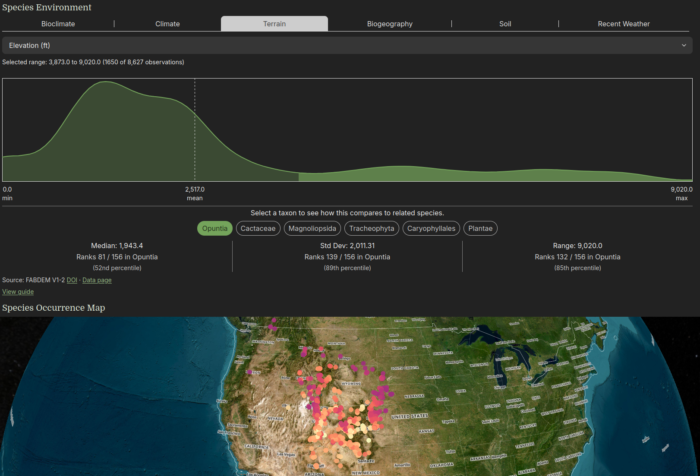

You can even highlight multiple ranges of the same density chart. Click and hold and drag again, and we could highlight both the highest and lowest elevation observations if we wanted to:

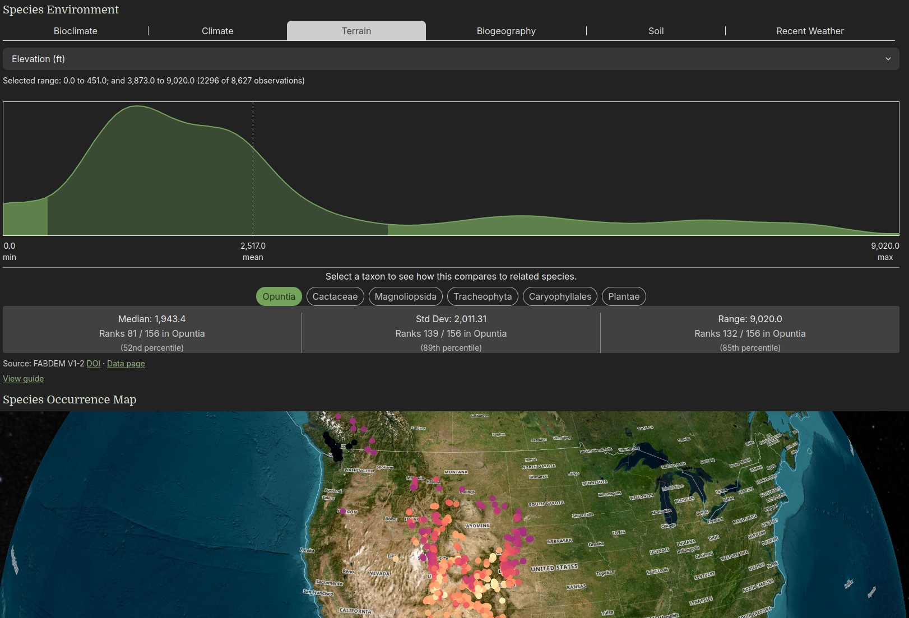

Click on the density chart to reset the filters. Then, re-highlight the upper end of the elevation graph again, then switch variables to the "Bioclimate" section, then "Annual Precipitation".
This keeps the high-elevation filter *active*, allowing us to see the annual precipitation of these high-elevation observations.

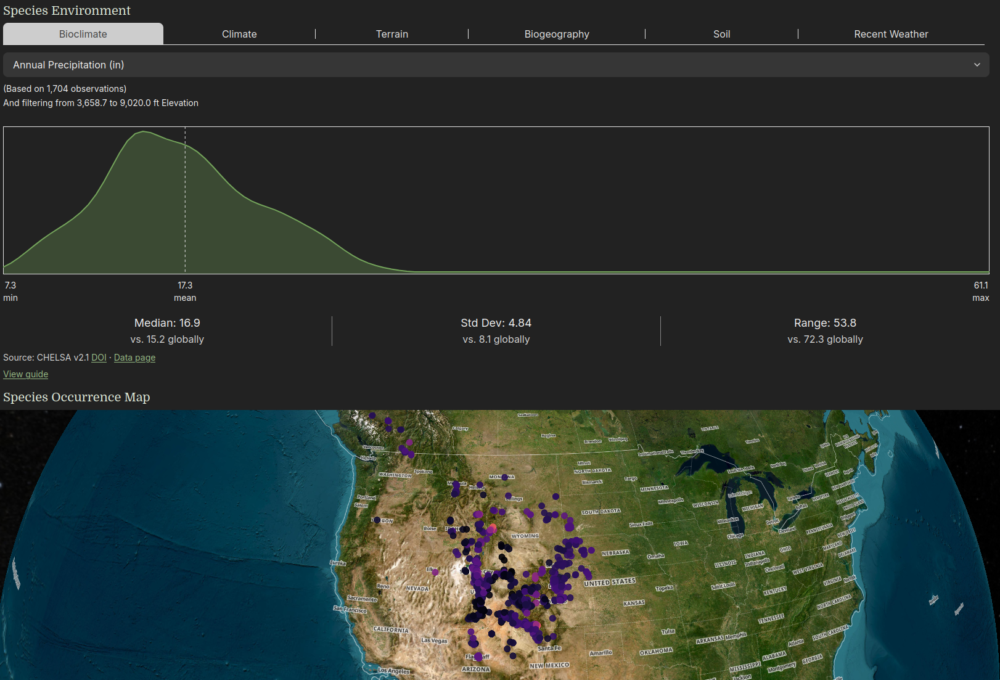

The mean precipitation is slightly higher, which is perhaps not surprising. Going to the "Biogeography" section, landcover will come up again. You can click on the pills or the relevant section of the bar to highlight only observations with those values as well, with clicking and holding allowing for the selection of extra classes on top of the current selection.

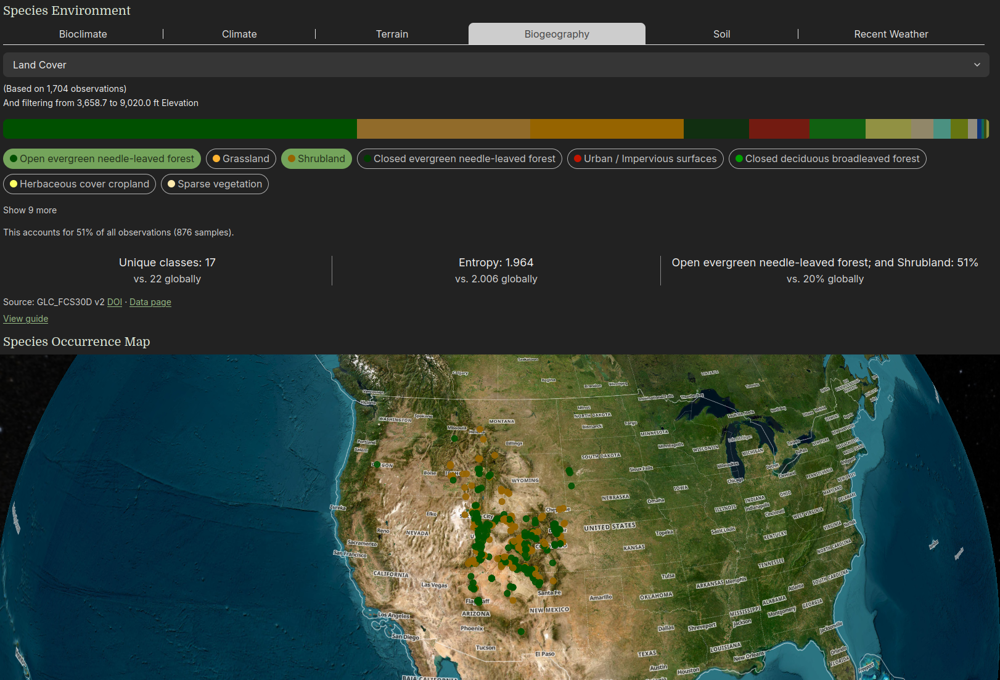

These selections persist on reload and shared links, which is a good way to share any selection with anyone else. You can deselect them manually or remove them from the url to get back to a clean slate.

## Map controls

### Color Picker

There are a few more nice features the map has. Go back to a variable such as elevation. You'll see a color picker in the bottom right, allowing you to choose from 6 different color gradients, which update the way the dots are colored on the map:
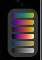

For nominal variables such as landcover, you'll see instead three options. The top option is the default coloration, usually using the legend from the source. The second option is a coloration designed to be more colorblind-friendly, however there are limits to how much this can be accomplished. The third option will make the dots instead display as shapes, hopefully offering better visualization to users with certain vision deficiencies.

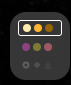

For circular variables such as aspect you can change the offset of the color gradient, or have them display in shapes as well corresponding to their cardinal direction:

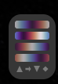

### Top Right Controls

The top right contains various controls. You can hover over each button for a tip as to what it does. There are +- buttons controlling zoom, and a compass showing the map orientation, that can be clicked to reset back to north being the top of the map.

There is a location picker right below that will add a marker for your current location, if you are comfortable with providing it. It is not sent to our servers at all, we don't want your data!

Next there is a fullscreen button.

After that there is a button to switch into 2d vs globe view. When in 2d mode, you can click the pencil icon to start drawing a polygon on the map. The polygon will filter observations just like any other filter, and transfer over for when you switch back over to globe view, which is the default.

Below the switcher there is a mountain symbol that toggles 3d terrain. 3d terrain is much more noticeable when zoomed in and at an angle. By holding control and dragging on the map, you can control the pitch of the camera angle. On mobile this is done by scrolling with two fingers at once.

Right below that, there is the basemap picker. You can toggle between a basic tile basemap, satellite basemap, and the selected variable as a basemap. When the basic tile basemap is selected, there will be a pallette icon that allows you to change the theme of the basemap.

Finally, there is an upload button that allows you to upload a geojson of any bounding box you want, and it will apply it as a "location filter" of sorts just like any other filter. When polygon filters are in place, you can click the eraser icon to remove the one at the top of the stack.

# Custom Upload Page

One drawback about WhereWild is that is uses iNaturalist occurrence data, which in some ways is noisy, taxnomically weird, or simply not ideal to any kind of serious analysis. Luckily, we support uploading of custom datasets to allow similar analysis of "cleaned" occurrence data.

The term "upload" here is used somewhat loosely. The data is not stored permanently or served to other users on our end. This simply allows you to upload observations so we can combine them with environmental data and then send it to your browser to allow analysis of the data the same way the regular species page does. The upload page is found simply at the upload page in the header at the top right.

## What Do I Upload?

Simply click the upload button on "Step 1" on the upload page. All you need is a csv with each row being an observation, at a minimum having columns for lat and lon. You can optionally include columns for observationId (to map original rows to output rows cleanly), and timestamp if wanting to have temporal variables processed as well, but do note that this makes the job take much longer to complete. Most will finish in around 30-45 seconds.

Once the upload is finished, the data will automatically be mounted in your browser, and you will be able to do essentially everything you can on the normal species page, while all of the computation runs locally on your browser only.

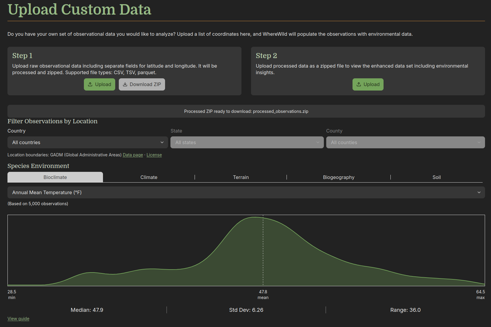

You'll also be able to download the processed result as a zip by clicking the "Download ZIP" button. This allows you to have the data yourself to perform any kind of analysis you want on the data yourself. The zip will contain many files in parquet and csv format (parquet is a columnar file format great for big datasets, and can be converted to csv in Python very easily regardless); many of these files are used internally for proper display on this page. The important one is the occurrence file, which contains all the original rows along with their added GIS values.

## Already Processed ZIPs and Offline Functionality

Another good reason to download the processed ZIP is that it allows you to simply mount the files in your browser without having to wait for processing if coming back to the page, by clicking "Step 2" instead and selecting the ZIP.

This even works with data from WhereWild if you don't have your own data, by clicking the "Upload" button on the top right of the species page, which downloads a zip similar to the result you would get from uploading a custom dataset.

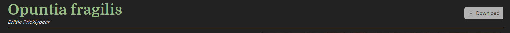

This is useful as the custom upload page works even when the browser is offline, *provided is has been loaded while online at least once*. It will also cache satellite and terrain tiles, allowing you to preload an area while online, allowing you to get a good quality offline map. A "cache" button will appear as the last button on the buttons on the right when offline, which toggles whether or not cached tiles are used vs an offline fallback map.

# Advanced Search

WhereWild supports advanced searching to allow finding taxa while sorting and filtering output in relation to statistics about their environmental preferences. Press the enter key while having selected the search bar, then the "filter" button in the header. It'll pull up a screen with many advanced search options:

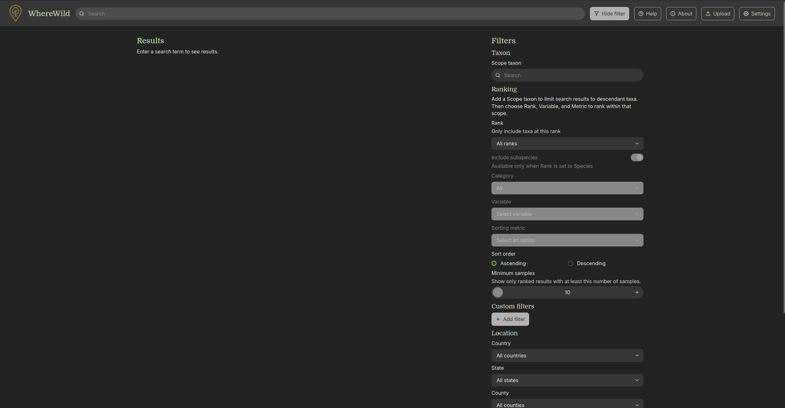

## Scope Taxon

Filters results to only those within a certain taxon

## Rank

Only include taxa at the selected rank

## Category, Variable and Metric

Select which variable and metric to sort results by. Example: average annual precipitation.

## Sort Order & Minimum Samples

Which order to sort results by, and how many samples (observations) a taxon needs at minimum to be shown.

## Additional Filters

Add filters that need to satisfy some condition for a given variable and metric.

An example with many of these filters applied is the following, where we see all cacti species sorted by their median annual mean temperatures, filtered to those with a median of at least 50 degrees Fahrenheit:

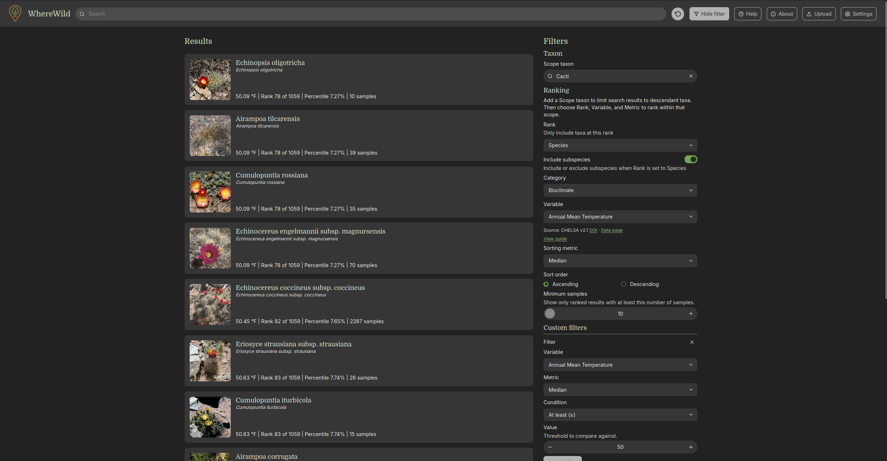

We also support location filtering (just like the species page) that filters to only taxa found within the selected location (with at least as many samples as the selected minimum samples), and the number of results per page, as well as pagination.

## An Example?

Let's say you wanted to find species of cacti that can tolerate lots of snow in North America, as many species can't. You simply set cacti as the scope taxon, filter to the US, sort by a snow-related variable such as Snow Cover Duration, then sort by the maximum value, descending. The list will then show a sorted list of North American cacti by their maximum snow tolerance:

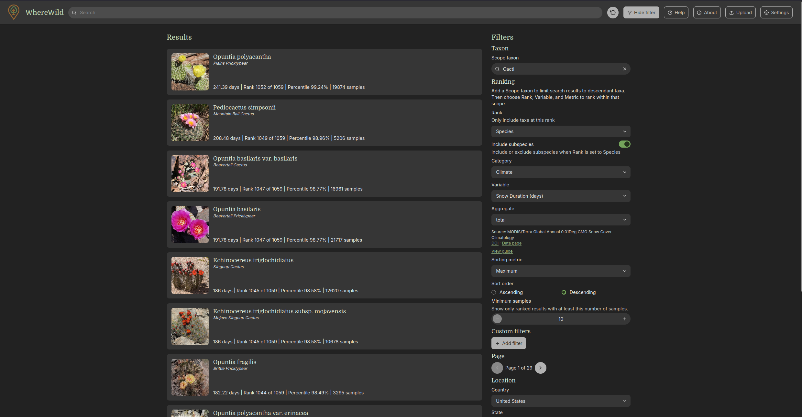

Opuntia basilaris may seem like a surprising result, as it typically inhabits very xeric environments. Navigating to its species page however, we can see some extreme outlier observations up a few canyons in the Sierra Nevadas, which is just one example of many cool discoveries WhereWild helps make:

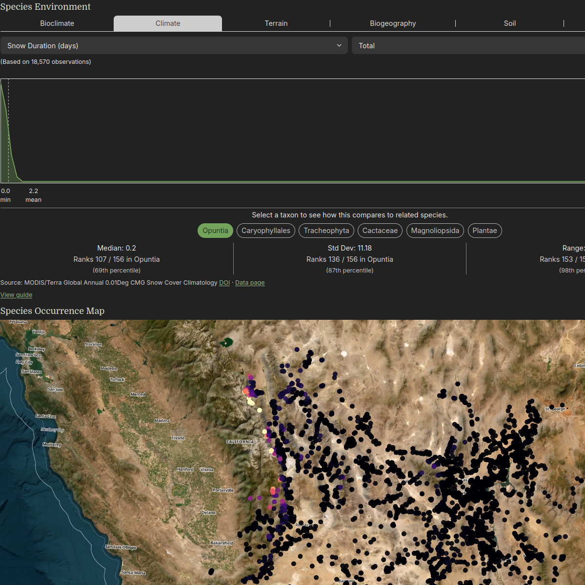

You can try all sorts of cool queries out; find plants that grow on the highest peaks, the hottest deserts, and the most desolate tundras!

